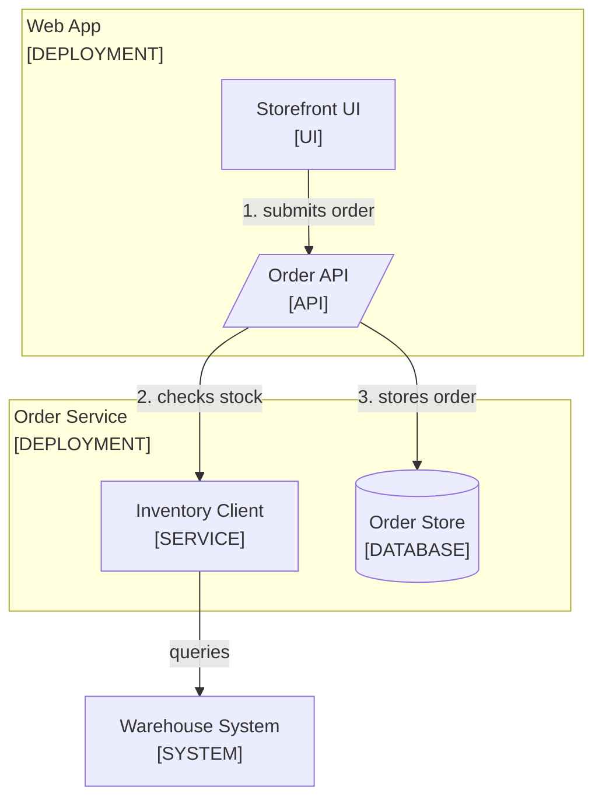

<!--
Purpose: Conventions and examples for static application structure, ownership, dependency, and trust diagrams.
Type: reference
-->

# Application Diagrams

Audience: the writer, when a reader needs application structure rather than request order.

Use `flowchart TD`. Show components at one abstraction level. A deployable
service, in-process module, API boundary, and stored payload belong together
only when their dependency is the point of the diagram.

## Grammar

| Element | Rule |
| --- | --- |
| Type | `flowchart TD` for static structure. |
| Node label | `Title<br/>[TYPE]`, quoted. Title is one to three words; TYPE is from the closed list below. |
| Shape | Chosen by TYPE: `id["..."]` rectangle, `id[("...")]` cylinder, `id[/"..."/]` parallelogram. |
| Subgraph | A real typed boundary in the shared [boundary format](mermaid.md#boundaries). |
| Edge label | Required on every edge, one to four words, a verb: `-->\|"validates"\|`. |
| Step numbers | Prefix edge labels `1.`, `2.` when the diagram is a flow. Numbers mean order, never ownership. |
| Forbidden | `click`, horizontal flowcharts, decorative subgraphs, and ASCII diagrams. |

| TYPE | Means | Shape |
| --- | --- | --- |
| PERSON | A human actor | Rectangle |
| TEAM | An owning team | Rectangle |
| UI | Rendered browser surface | Rectangle |
| API | HTTP route or endpoint | Parallelogram |
| AGENT | LLM-driven runner | Rectangle |
| TOOL | A callable agent tool | Rectangle |
| SERVICE | Deterministic module | Rectangle |
| SYSTEM | A whole deployment | Rectangle |
| DATA, DATABASE | Payload or store | Cylinder |

A new TYPE requires editing this file, so one concept is never tagged two
ways in two documents.

## Boundaries

Allowed types are `TEAM`, `DEPLOYMENT`, `TRUST BOUNDARY`, and `REPO`.
Most application diagrams need no subgraph. A real boundary follows the
shared [boundary format](mermaid.md#boundaries).

## Example

The block below is copied verbatim into a document, with real paths.

````markdown
The order API checks inventory before it stores the order.



1. The browser submits the customer's order.
2. The API checks stock through the inventory client.
3. The API stores an accepted order.

| Node | Source |
| --- | --- |
| Storefront UI | [src/web/](../src/web/) |
| Order API | [orders.ts](../src/api/orders.ts) |
| Inventory Client | [inventory.py](../src/inventory/client.py) |
| Order Store | [migrations/](../migrations/) |
| Warehouse System | - |
````
