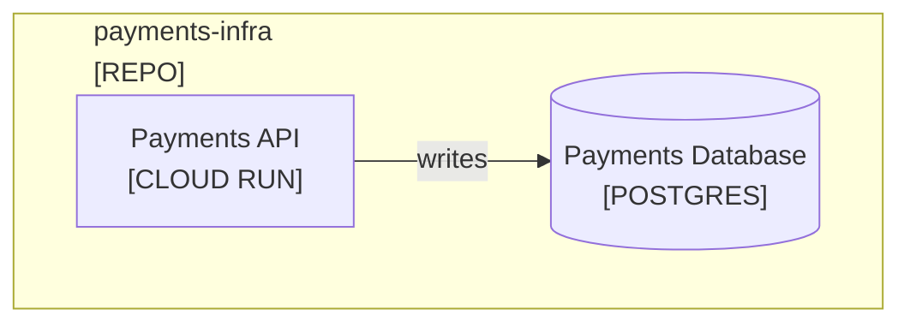

<!--
Purpose: Conventions for professional provisioning diagrams across repositories, clouds, and on-premises environments.
Type: reference
-->

# Infrastructure Diagrams

Audience: the writer, when a reader needs provisioning ownership and deployed resource topology.

Use `flowchart TD`. Read from foundation and shared services at the top to
workloads and state below. Show repository provisioning boundaries before
resource detail when several repositories manage one environment.

## Boundaries

Allowed types are `REPO`, `ENVIRONMENT`, `NETWORK`, `TRUST BOUNDARY`,
`DATACENTER`, `SUBSCRIPTION`, and `GCP PROJECT`.

Every boundary is pale yellow and has a left-aligned two-line label. Use this
markup, then render and adjust `width` to the boundary width minus its padding:

````markdown


| Node | Source |
| --- | --- |
| Payments API | - |
| Payments Database | - |
````

Never create a boundary for a layer, phase, or visual shortcut. Use one
boundary for one owner or isolation rule. Nested boundaries must express
different facts, such as repository ownership around a network boundary.

## Resource Labels

Write `Resource Name<br/>[PLATFORM SERVICE]`. Use the deployed technology or
managed service, never generic `SYSTEM`, `SERVICE`, or `DATABASE`.

| Context | Preferred Types |
| --- | --- |
| GCP | `CLOUD RUN`, `CLOUD RUN JOB`, `GCP PROJECT`, `VPC`, `PRIVATE SERVICE CONNECT`, `EXTERNAL LOAD BALANCER`, `CLOUD SQL`, `SECRET MANAGER` |
| Azure | `AZURE APP SERVICE`, `AZURE FUNCTIONS`, `AZURE SQL`, `VIRTUAL NETWORK`, `APPLICATION GATEWAY`, `KEY VAULT` |
| On-premises | `KUBERNETES`, `VM`, `PHYSICAL SERVER`, `POSTGRES`, `FIREWALL`, `LOAD BALANCER`, `DNS` |
| Cross-platform | `OBJECT STORAGE`, `MESSAGE BROKER`, `CONTAINER REGISTRY` |

Use a specific engine such as `POSTGRES` when it helps the reader more than
the hosting product. Add a new uppercase type only when it is the official
service or technology name and existing types would mislead.

## Layout

- Prefer three sibling resources per row; accept four only after visual inspection.
- Keep foundational repositories above repositories that consume their resources.
- Use one box per independently deployed resource when failure or ownership differs.
- Group repeated instances only when they share lifecycle, owner, and platform type.
- Omit monitoring, IAM bindings, and helper resources unless they explain the requested boundary.

For a multi-repository environment, show every provisioning boundary but
expand only the boundary relevant to the document. Keep the other boundaries
compact enough to preserve ownership context.
