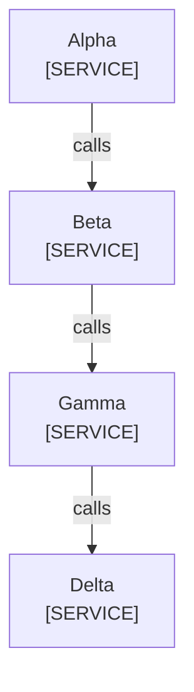

<!--
Purpose: Fixture.
Type: explanation
-->

# Edge Owner

Audience: maintainers, to see one rule fail.

The first file owns the relationship.

| Node | Source |
| --- | --- |
| Alpha | - |
| Beta | - |
| Gamma | - |
| Delta | - |
