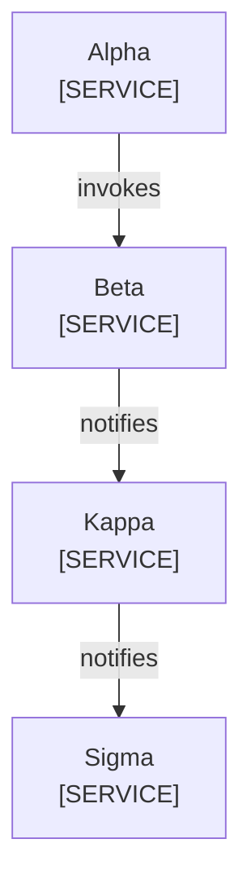

<!--
Purpose: Fixture.
Type: explanation
-->

# Edge Copy

Audience: maintainers, to see one rule fail.

A second file draws it again.

| Node | Source |
| --- | --- |
| Alpha | - |
| Beta | - |
| Kappa | - |
| Sigma | - |
