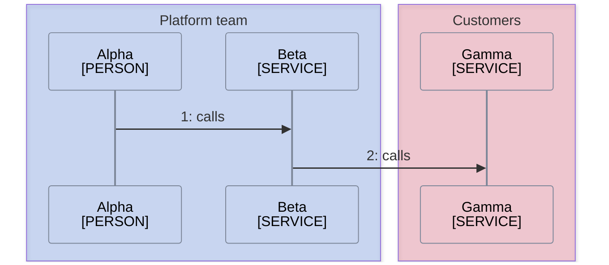

<!--
Purpose: Fixture.
Type: explanation
-->

# Band Person

> **Audience:** maintainers, to see one rule fail.

The block puts a person in an owner band and a service in the person band.

```mermaid
sequenceDiagram
  %%{init: {"themeVariables": {"actorBkg": "transparent", "actorBorder": "#7d8799", "actorLineColor": "#7d8799", "labelBoxBorderColor": "#7d8799"}}}%%
  box rgba(37,99,235,0.2) Platform team
    participant A as Alpha<br/>[PERSON]
    participant B as Beta<br/>[SERVICE]
  end
  box rgba(225,29,72,0.2) Customers
    participant C as Gamma<br/>[SERVICE]
  end
  A->>B: 1: calls
  B->>C: 2: calls
```
