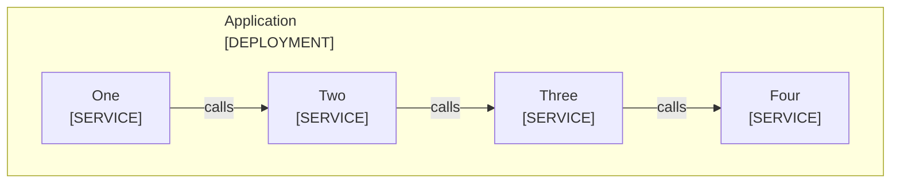

<!--
Purpose: Fixture.
Type: explanation
-->

# Boundary Direction

Audience: maintainers, to see one rule fail.

The boundary declares no direction.

| Node | Source |
| --- | --- |
| One | - |
| Two | - |
| Three | - |
| Four | - |
