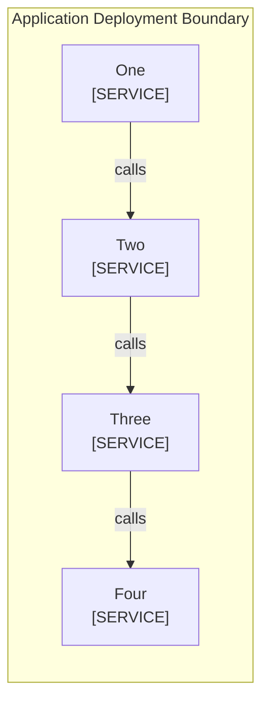

<!--
Purpose: Fixture.
Type: explanation
-->

# Boundary Width

Audience: maintainers, to see one rule fail.

The boundary title is long enough to wrap behind its first node.

| Node | Source |
| --- | --- |
| Application Deployment Boundary [DEPLOYMENT] | - |
| One | - |
| Two | - |
| Three | - |
| Four | - |
