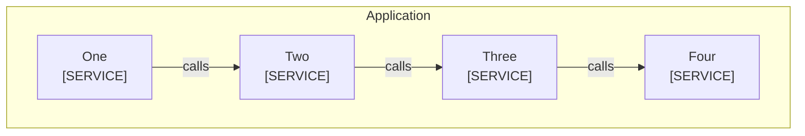

<!--
Purpose: Bad boundary fixture.
Type: explanation
-->

# Boundary

Audience: maintainers, to see a malformed boundary fail.

The components are grouped by a boundary with an untyped centered label.

| Node | Source |
| --- | --- |
| One | - |
| Two | - |
| Three | - |
| Four | - |
