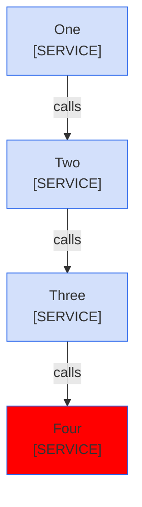

<!--
Purpose: Fixture.
Type: explanation
-->

# Color Style

> **Audience:** maintainers, to see one rule fail.

The block styles a node directly.

```mermaid
graph TD
  %%{init: {"themeCSS": ".cluster-label, .cluster-label div, .cluster-label span, .cluster-label p { text-align: center !important; }", "flowchart": {"curve": "rounded", "subGraphTitleMargin": {"top": 6, "bottom": 30}}}}%%
  One["One<br/>[SERVICE]"]
  Two["Two<br/>[SERVICE]"]
  Three["Three<br/>[SERVICE]"]
  Four["Four<br/>[SERVICE]"]
  One -->|"calls"| Two
  Two -->|"calls"| Three
  Three -->|"calls"| Four
  class One,Two,Three,Four own
  style Four fill:#ff0000
  classDef own fill:#2563eb33,stroke:#2563eb
```

> **Legend:** *🟦 Platform team*
