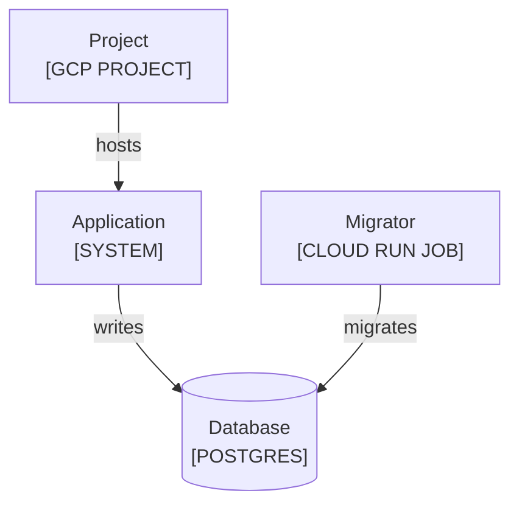

<!--
Purpose: Bad generic infrastructure type fixture.
Type: explanation
-->

# Generic Infrastructure

Audience: maintainers, to see a generic platform type fail.

The infrastructure diagram hides one deployed technology behind a generic label.

| Node | Source |
| --- | --- |
| Project | - |
| Application | - |
| Migrator | - |
| Database | - |
