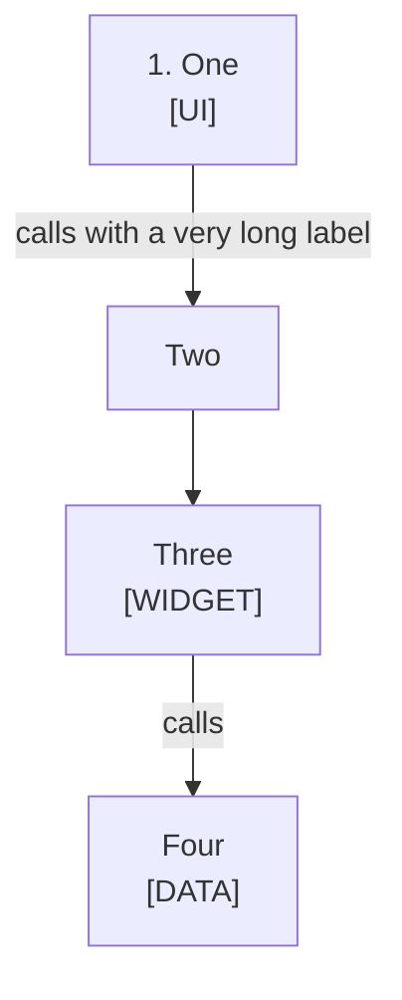

<!--
Purpose: Fixture.
Type: explanation
-->

# Title

Audience: nobody.

## Section

Lead.

```mermaid
graph TD
  A["1. One<br/>[UI]"] -->|"calls with a very long label"| B["Two"]
  B --> C["Three<br/>[WIDGET]"]
  C -->|"calls"| D["Four<br/>[DATA]"]
```

| Node | Source |
| --- | --- |
| 1. One | - |
| Two | - |
| Three | - |
| Four | - |
