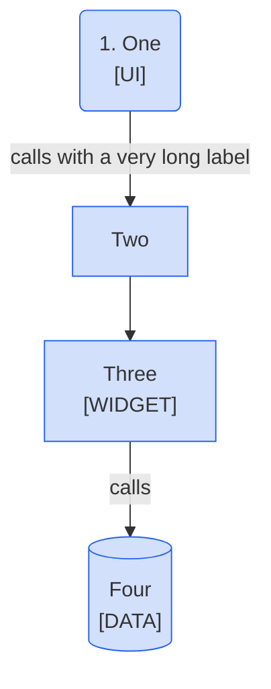

<!--
Purpose: Fixture.
Type: explanation
-->

# Title

> **Audience:** nobody.

## Section

Lead.

```mermaid
graph TD
  %%{init: {"themeCSS": ".cluster-label, .cluster-label div, .cluster-label span, .cluster-label p { text-align: center !important; }", "flowchart": {"curve": "rounded", "subGraphTitleMargin": {"top": 6, "bottom": 30}}}}%%
  A("1. One<br/>[UI]") -->|"calls with a very long label"| B["Two"]
  B --> C["Three<br/>[WIDGET]"]
  C -->|"calls"| D[("Four<br/>[DATA]")]

  class A,B,C,D own
  classDef own fill:#2563eb33,stroke:#2563eb
```

> **Legend:** *🟦 Example team*
