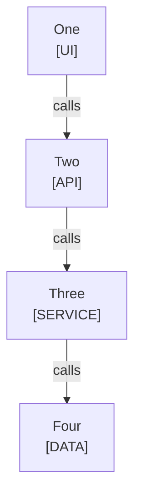

<!--
Purpose: Fixture.
Type: explanation
-->

# Title

Audience: nobody.

## Section

```mermaid
graph TD
  A["One<br/>[UI]"] -->|"calls"| B["Two<br/>[API]"]
  B -->|"calls"| C["Three<br/>[SERVICE]"]
  C -->|"calls"| D["Four<br/>[DATA]"]
```

| Node | Source |
| --- | --- |
| One | - |
| Two | - |
| Three | - |
