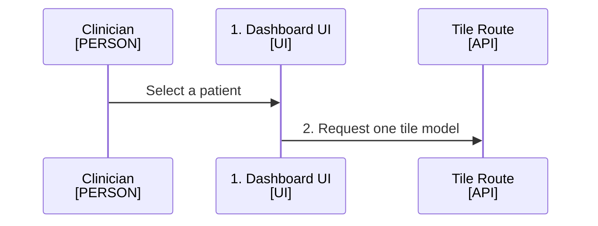

<!--
Purpose: Fixture.
Type: explanation
-->

# Title

Audience: nobody.

## Section

Lead.

```mermaid
sequenceDiagram
  participant Clinician as Clinician<br/>[PERSON]
  participant Browser as 1. Dashboard UI<br/>[UI]
  participant Route as Tile Route<br/>[API]

  Clinician->>Browser: Select a patient
  Browser->>Route: 2. Request one tile model
```

| Node | Source |
| --- | --- |
| Clinician | - |
| 1. Dashboard UI | - |
| Tile Route | - |
