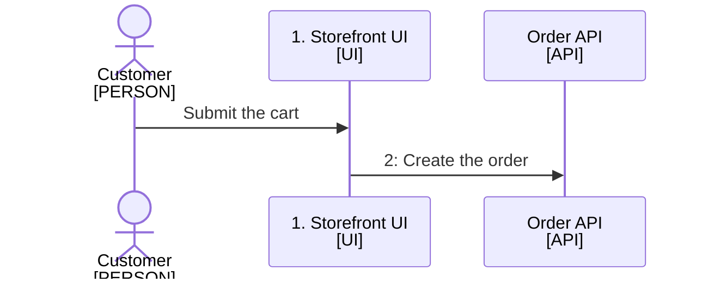

<!--
Purpose: Fixture.
Type: explanation
-->

# Title

Audience: nobody.

## Section

Lead.

```mermaid
sequenceDiagram
  actor Customer as Customer<br/>[PERSON]
  participant Browser as 1. Storefront UI<br/>[UI]
  participant Route as Order API<br/>[API]

  Customer->>Browser: Submit the cart
  Browser->>Route: 2: Create the order
```

| Node | Source |
| --- | --- |
| Customer | - |
| 1. Storefront UI | - |
| Order API | - |
