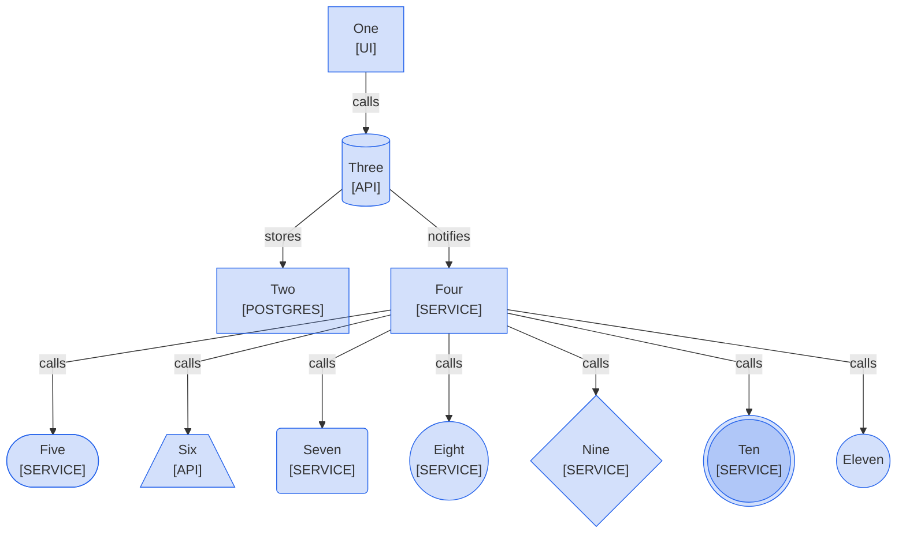

<!--
Purpose: Fixture.
Type: explanation
-->

# Title

> **Audience:** nobody.

## Section

Nodes B, C, and E to K each break the shape rule once.

```mermaid
graph TD
  %%{init: {"themeCSS": ".cluster-label, .cluster-label div, .cluster-label span, .cluster-label p { text-align: center !important; }", "flowchart": {"curve": "rounded", "subGraphTitleMargin": {"top": 6, "bottom": 30}}}}%%
  A["One<br/>[UI]"]
  B["Two<br/>[POSTGRES]"]
  C[("Three<br/>[API]")]
  D["Four<br/>[SERVICE]"]
  E(["Five<br/>[SERVICE]"])
  F[/"Six<br/>[API]"\]
  G("Seven<br/>[SERVICE]")
  H(("Eight<br/>[SERVICE]"))
  I{"Nine<br/>[SERVICE]"}
  J((("Ten<br/>[SERVICE]")))
  K@{ shape: circle, label: "Eleven" }
  A -->|"calls"| C
  C -->|"stores"| B
  C -->|"notifies"| D
  D -->|"calls"| E
  D -->|"calls"| F
  D -->|"calls"| G
  D -->|"calls"| H
  D -->|"calls"| I
  D -->|"calls"| J
  D -->|"calls"| K

  class A,B,C,D,E,F,G,H,I,J,K own
  classDef own fill:#2563eb33,stroke:#2563eb
```

> **Legend:** *🟦 Example team*
