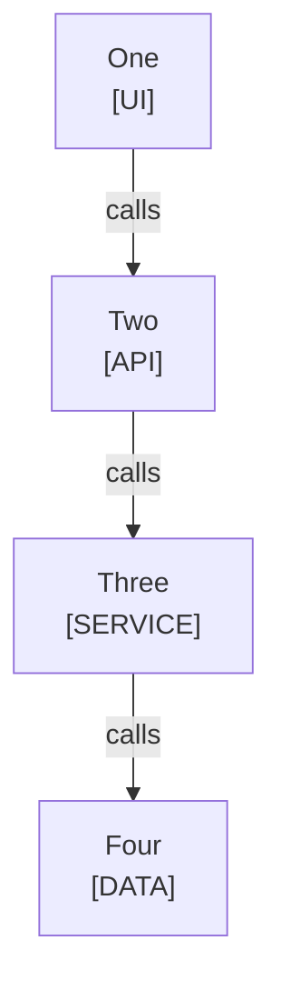

<!--
Purpose: Fixture.
Type: explanation
-->

# Title

Audience: nobody.

## Section

Lead.

```mermaid
flowchart TD
  A["One<br/>[UI]"] -->|"calls"| B["Two<br/>[API]"]
  B -->|"calls"| C["Three<br/>[SERVICE]"]
  C -->|"calls"| D["Four<br/>[DATA]"]
```

Prose instead of the table.
