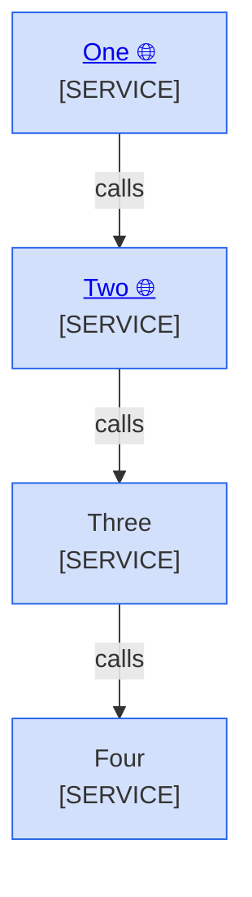

<!--
Purpose: Fixture.
Type: explanation
-->

# Title

> **Audience:** maintainers, to see one rule fail.

## Section

One node links a file that does not exist.

```mermaid
graph TD
  %%{init: {"themeCSS": ".cluster-label, .cluster-label div, .cluster-label span, .cluster-label p { text-align: center !important; }", "flowchart": {"curve": "rounded", "subGraphTitleMargin": {"top": 6, "bottom": 30}}}}%%
  A["<a href='missing.md'>One 🌐</a><br/>[SERVICE]"]
  B["<a href='mmd-click.md'>Two 🌐</a><br/>[SERVICE]"]
  C["Three<br/>[SERVICE]"]
  D["Four<br/>[SERVICE]"]
  A -->|"calls"| B
  B -->|"calls"| C
  C -->|"calls"| D

  class A,B,C,D own
  classDef own fill:#2563eb33,stroke:#2563eb
```

> **Legend:** *🟦 Example team*
