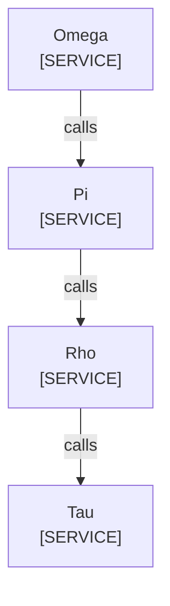

<!--
Purpose: Fixture.
Type: explanation
-->

# Node Owner

Audience: maintainers, to see one rule fail.

The title has no source here.

| Node | Source |
| --- | --- |
| Omega | - |
| Pi | - |
| Rho | - |
| Tau | - |
