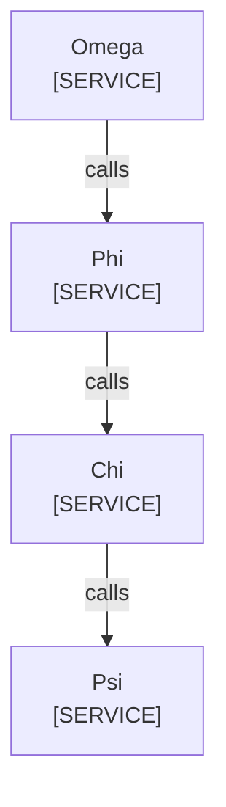

<!--
Purpose: Fixture.
Type: explanation
-->

# Node Drift

Audience: maintainers, to see one rule fail.

The same title points at a file here.

| Node | Source |
| --- | --- |
| Omega | [link.md](link.md) |
| Phi | - |
| Chi | - |
| Psi | - |
