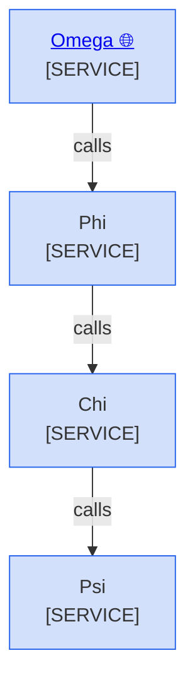

<!--
Purpose: Fixture.
Type: explanation
-->

# Node Drift

> **Audience:** maintainers, to see one rule fail.

The same title points at a file here.

```mermaid
graph TD
  %%{init: {"themeCSS": ".cluster-label, .cluster-label div, .cluster-label span, .cluster-label p { text-align: center !important; }", "flowchart": {"curve": "rounded", "subGraphTitleMargin": {"top": 6, "bottom": 30}}}}%%
  Omega["<a href='link.md'>Omega 🌐</a><br/>[SERVICE]"]
  Phi["Phi<br/>[SERVICE]"]
  Chi["Chi<br/>[SERVICE]"]
  Psi["Psi<br/>[SERVICE]"]
  Omega -->|"calls"| Phi
  Phi -->|"calls"| Chi
  Chi -->|"calls"| Psi

  class Omega,Phi,Chi,Psi own
  classDef own fill:#2563eb33,stroke:#2563eb
```

> **Legend:** *🟦 Example team*
