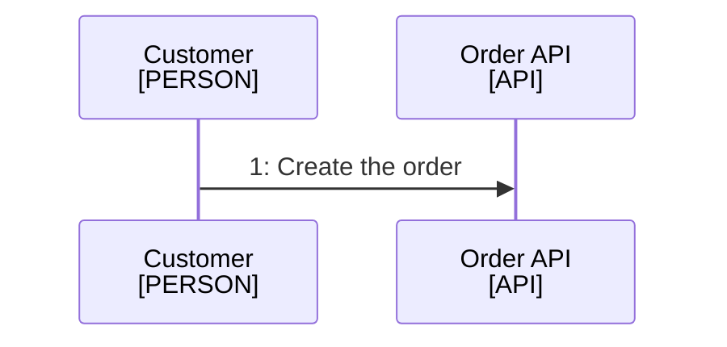

<!--
Purpose: Fixture.
Type: explanation
-->

# Architecture

Audience: maintainers, to see one rule fail.

The owner file holds another family.

| Node | Source |
| --- | --- |
| Customer | - |
| Order API | - |
