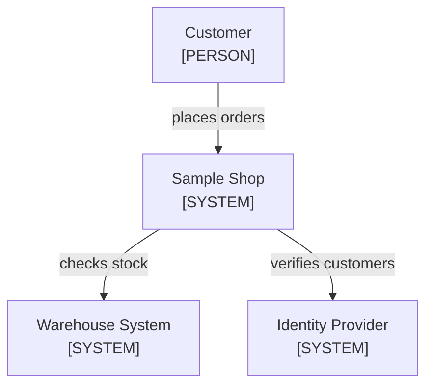

<!--
Purpose: Entry point for the sample shop: what it is, how to run it, where the guides live.
Type: readme-project
-->

# Sample Shop

A storefront that checks inventory before accepting an order.

## Introduction

Customers need current inventory while placing an order. This project checks
the warehouse system before it stores each order.

The shop sits between its customers and two outside systems.



| Node | Source |
| --- | --- |
| Customer | - |
| Sample Shop | [docs/architecture.md](docs/architecture.md) |
| Warehouse System | - |
| Identity Provider | - |

## Getting Started

### Prerequisites

- Node.js 22 or newer.

### Installation

1. Copy the environment template: `cp .env.example .env`.

### Usage

```bash
./run.sh
```

## Resources

| Resource | What It Answers |
| --- | --- |
| [docs/README.md](docs/README.md) | Where to start and which guide answers which task |
| [docs/architecture.md](docs/architecture.md) | Deployments, ownership, and dependency direction |
