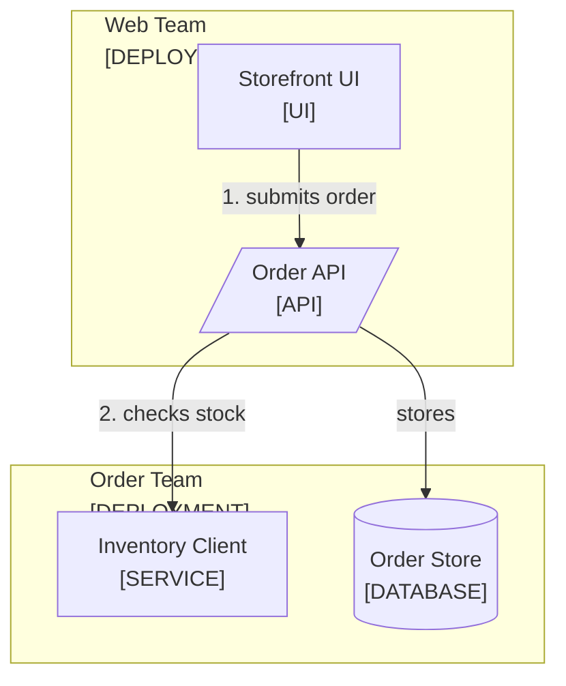

<!--
Purpose: Entry point for the sample shop: what it is, how to run it, where the guides live.
Type: readme-project
-->

# Sample Shop

A storefront that checks inventory before accepting an order.

## Introduction

Customers need current inventory while placing an order. This project checks
the warehouse system before it stores each order.

One request path shows how the pieces relate.



1. The browser sends one order to its API.
2. The API checks stock through the inventory client.

| Node | Source |
| --- | --- |
| Storefront UI | [src/](src/) |
| Order API | [src/api.ts](src/api.ts) |
| Inventory Client | [src/inventory/client.ts](src/inventory/client.ts) |
| Order Store | - |

## Getting Started

### Prerequisites

- Node.js 22 or newer.

### Installation

1. Copy the environment template: `cp .env.example .env`.

### Usage

```bash
./run.sh
```

## Resources

| Resource | What It Answers |
| --- | --- |
| [docs/README.md](docs/README.md) | Where to start and which guide answers which task |
| [docs/architecture.md](docs/architecture.md) | Deployments, ownership, and dependency direction |
