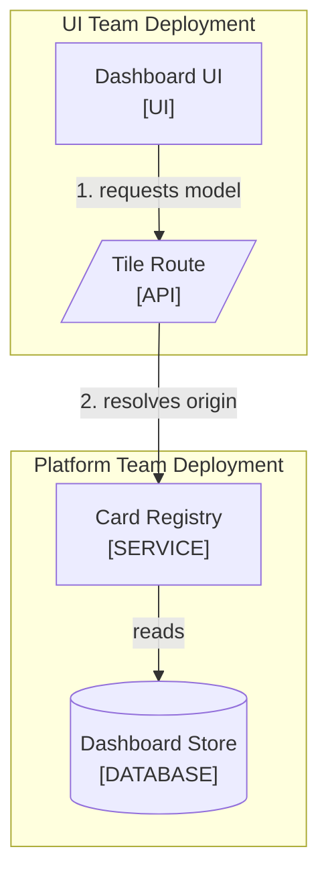

<!--
Purpose: Entry point for the sample dashboard: what it is, how to run it, where the guides live.
Type: readme-project
-->

# Sample Dashboard

A dashboard that renders tiles from independently deployed services.

## Introduction

Clinicians need one screen that shows data from several services. This
project assembles that screen from tiles, each served by its own team.

One request path shows how the pieces relate.



1. The browser asks its own server for one tile's model.
2. The server resolves the saved capability through the registry.

| Node | Source |
| --- | --- |
| Dashboard UI | [src/](src/) |
| Tile Route | [src/api.ts](src/api.ts) |
| Card Registry | [src/widgets/registry.ts](src/widgets/registry.ts) |
| Dashboard Store | - |

## Getting Started

### Prerequisites

- Node.js 22 or newer.

### Installation

1. Copy the environment template: `cp .env.example .env`.

### Usage

```bash
./run.sh
```

## Resources

| Resource | What It Answers |
| --- | --- |
| [docs/README.md](docs/README.md) | Where to start and which guide answers which task |
| [docs/architecture.md](docs/architecture.md) | Deployments, ownership, and dependency direction |
