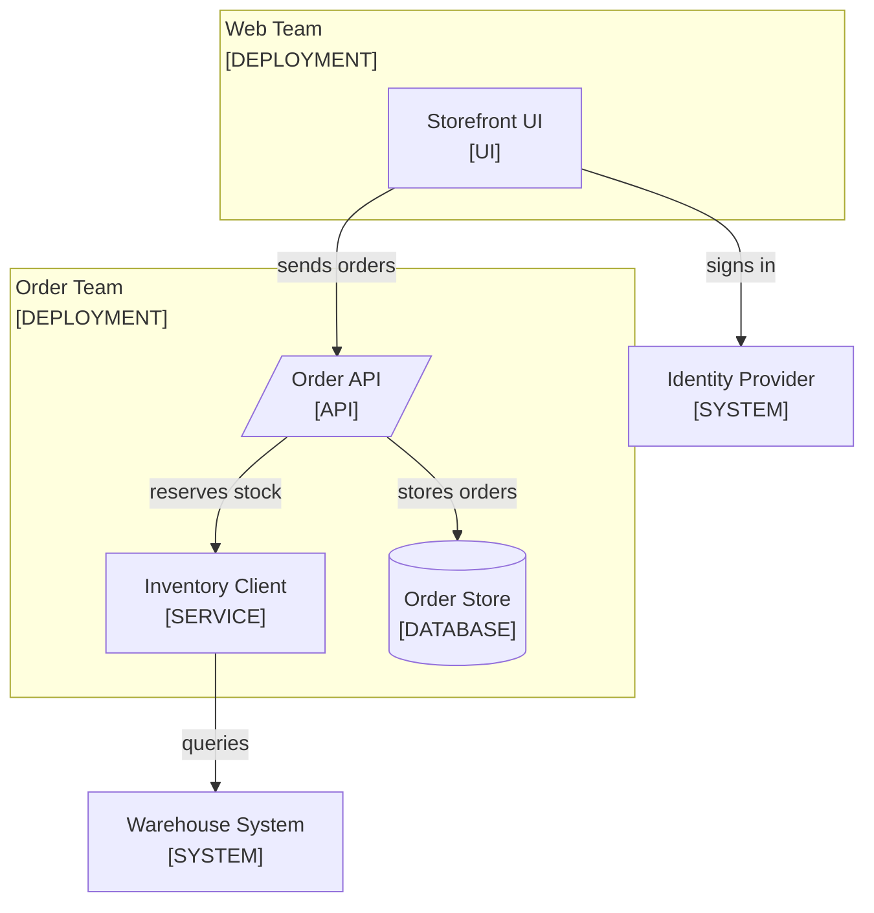

<!--
Purpose: The deployments, who owns each, and the one allowed dependency direction.
Type: explanation
-->

# Architecture

Audience: all teams, to answer what exists and who owns it.

## Deployments

Two teams ship independently, and only a versioned contract crosses the line
between them.

| Node | Source |
| --- | --- |
| Storefront UI | [../src/](../src/) |
| Order API | [../src/api.ts](../src/api.ts) |
| Inventory Client | [../src/inventory/client.ts](../src/inventory/client.ts) |
| Order Store | - |
| Identity Provider | - |
| Warehouse System | - |

The UI never writes inventory directly. The order API coordinates the
reservation so one component owns the transaction boundary.

Sign-in has its own guide: [authentication.md](authentication.md).
