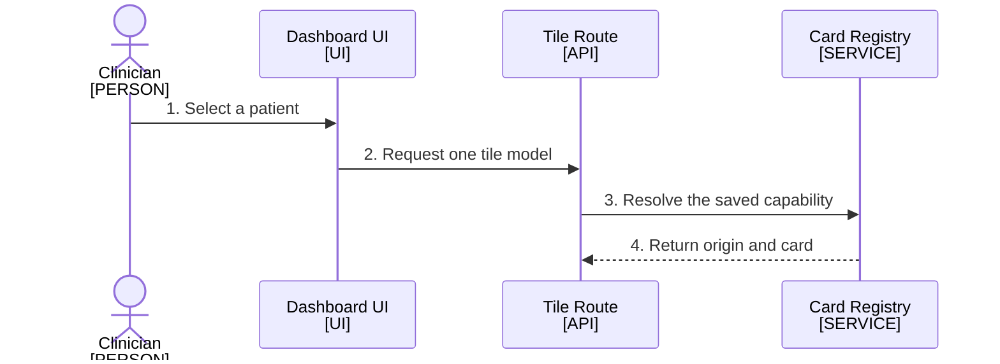

<!--
Purpose: The deployments, who owns each, and the one allowed dependency direction.
Type: explanation
-->

# Architecture

Audience: all teams, to answer what exists and who owns it.

## Deployments

Two teams ship independently, and only a versioned contract crosses the line
between them.

1. The clinician selects a patient, which unlocks every tile.
2. Each tile asks the server for its own model.
3. The server resolves the origin from the registry.
4. The registry answers from its cache.

| Node | Source |
| --- | --- |
| Clinician | - |
| Dashboard UI | [../src/](../src/) |
| Tile Route | [../src/api.ts](../src/api.ts) |
| Card Registry | [../src/widgets/registry.ts](../src/widgets/registry.ts) |

The UI never stores a service URL. It resolves the origin on every request,
so removing a service from the registry takes effect within one refresh.
