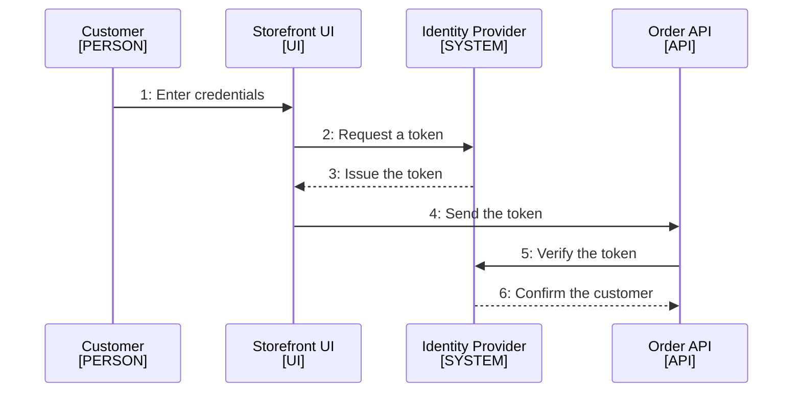

<!--
Purpose: How a customer proves who they are and how the order API trusts each request.
Type: explanation
-->

# Authentication

Audience: all teams, to answer how a request proves who sent it.

## Customer Login

The storefront trades a login for a token, and the API verifies that token on
every call.

| Node | Source |
| --- | --- |
| Customer | - |
| Storefront UI | [../src/](../src/) |
| Identity Provider | - |
| Order API | [../src/api.ts](../src/api.ts) |

The API holds no passwords. It rejects any call whose token the identity
provider does not confirm.
