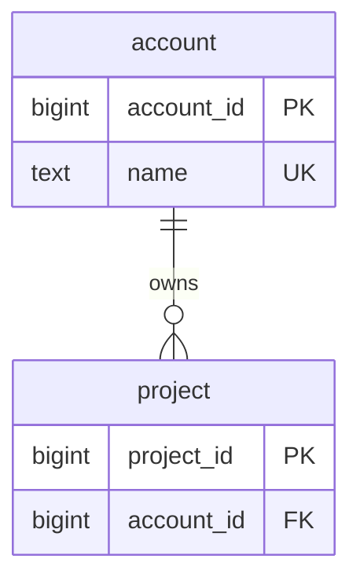

<!--
Purpose: Shows a valid relational data diagram with source ownership.
Type: reference
-->

# Data Relationships

Audience: backend developers, to understand account ownership.

An account owns projects through a required foreign key.

| Node | Source |
| --- | --- |
| account | - |
| project | - |
