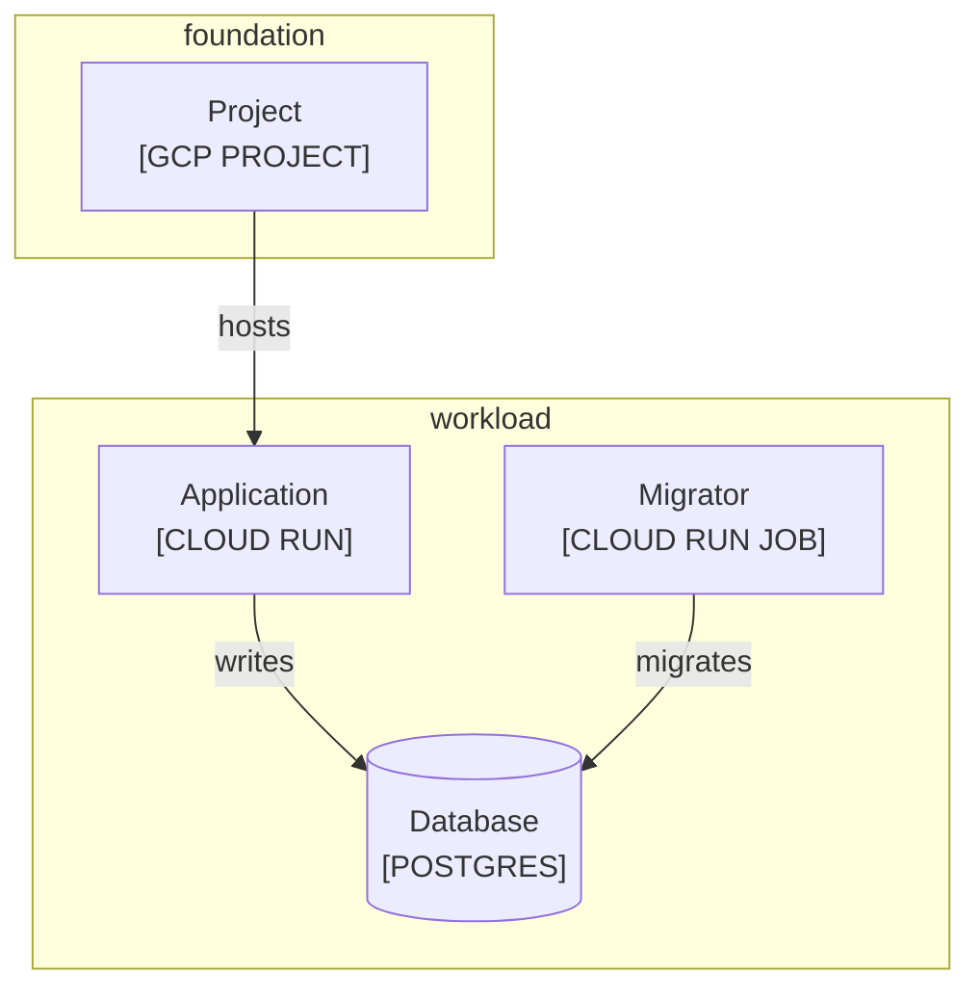

<!--
Purpose: Shows a valid infrastructure diagram with repository provisioning boundaries.
Type: explanation
-->

# Infrastructure

Audience: platform engineers, to identify provisioning ownership.

The repositories provision a workload and its database inside separate ownership boundaries.

| Node | Source |
| --- | --- |
| foundation [REPO] | - |
| workload [REPO] | - |
| Project | - |
| Application | - |
| Migrator | - |
| Database | - |
