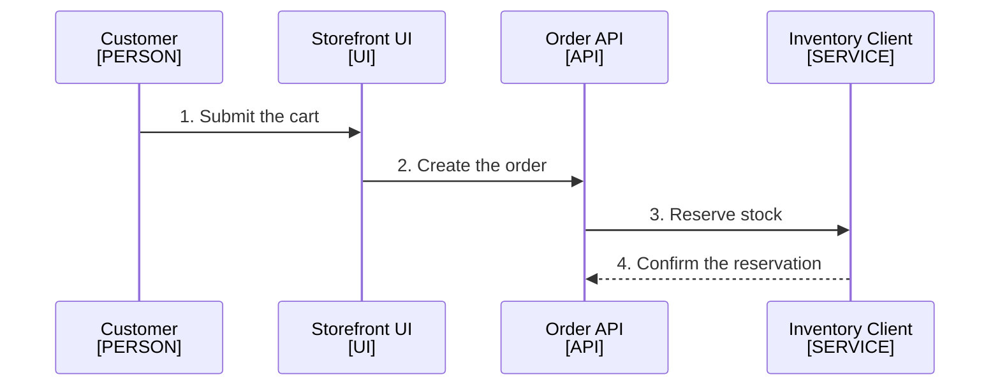

<!--
Purpose: The order of events on each request path that crosses a component boundary.
Type: explanation
-->

# Runtime Flows

Audience: all teams, to trace one request end to end.

## Place an Order

The API reserves stock before it accepts the cart.

1. The customer submits the current cart.
2. The storefront asks the API to create an order.
3. The API asks the inventory client to reserve stock.
4. The inventory client confirms the reservation.

| Node | Source |
| --- | --- |
| Customer | - |
| Storefront UI | [../src/](../src/) |
| Order API | [../src/api.ts](../src/api.ts) |
| Inventory Client | [../src/inventory/client.ts](../src/inventory/client.ts) |
