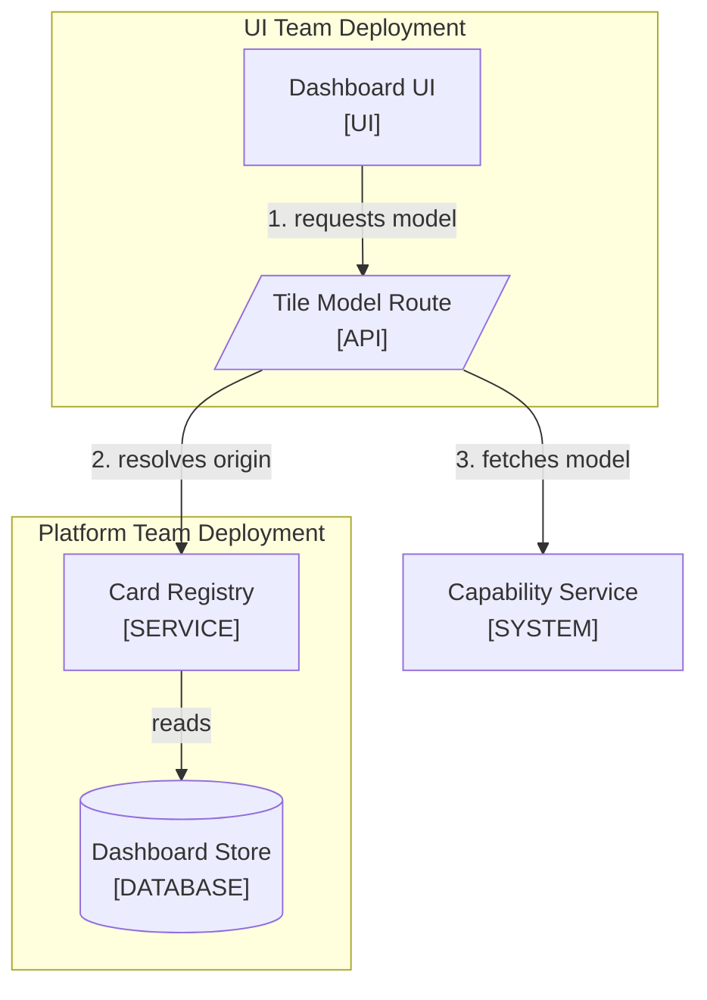

<!--
Purpose: The one diagram block every writing-docs document uses, with the node grammar, caps, and a rendered example.
Type: reference
-->

# Mermaid Diagrams

Audience: the writer, before drawing or editing any diagram.

Rendered README columns are narrow. Every diagram is small, reads top to
bottom, and follows the same block so a reader learns the pattern once.

## Table of Contents

- [The Diagram Block](#the-diagram-block)
- [Grammar](#grammar)
- [Caps](#caps)
- [Example](#example)
- [Render and Inspect](#render-and-inspect)

## The Diagram Block

Every diagram appears in exactly this order, with nothing else between the
parts. The lint checks the order (`MMD`).

1. One lead sentence saying what the diagram shows.
2. The fenced `mermaid` block.
3. A numbered list explaining each numbered edge, when the edges are numbered.
4. A `Node | Source` table with one row per node, in diagram order.

The Source cell links the file or directory behind the node. A concept node
(a payload, a value, a state) gets `-` as its source.

## Grammar

| Element | Rule |
| --- | --- |
| Type | `flowchart TD` for structure and flows; `sequenceDiagram` for ordered request traces. Nothing else. |
| Node label | `Title<br/>[TYPE]`, quoted. Title is one to three words; TYPE is from the closed list below. |
| Shape | Chosen by TYPE: `id["..."]` rectangle, `id[("...")]` cylinder, `id[/"..."/]` parallelogram. |
| Subgraph | A team deployment or a repo-relative directory, quoted: `subgraph UI["UI Team Deployment"]`. |
| Edge label | Required on every edge, one to four words, a verb: `-->\|"validates"\|`. |
| Step numbers | Prefix edge labels `1.`, `2.` when the diagram is a flow. Numbers mean order, never ownership. |
| Sequence participant | `actor` for PERSON, `participant` for every other TYPE, labelled with `as Title<br/>[TYPE]`, no ordinal prefix. |
| Sequence message | Numbered `1.`, `2.` so the prose can cite a step. |
| Forbidden | `click` directives, `LR`, `TB`, other diagram types, ASCII diagrams, HTML other than `<br/>`. |

| TYPE | Means | Shape |
| --- | --- | --- |
| PERSON | A human actor | Rectangle |
| TEAM | An owning team | Rectangle |
| UI | Rendered browser surface | Rectangle |
| API | HTTP route or endpoint | Parallelogram |
| AGENT | LLM-driven runner | Rectangle |
| TOOL | A callable agent tool | Rectangle |
| SERVICE | Deterministic module | Rectangle |
| SYSTEM | A whole deployment | Rectangle |
| DATA, DATABASE | Payload or store | Cylinder |

A new TYPE requires editing this file, so one concept is never tagged two
ways in two documents.

## Caps

| Limit | Value |
| --- | ---: |
| Nodes per flowchart | 4 to 12 |
| Siblings abreast | 4 |
| Sequence participants | 7 |
| Sequence messages | 12 |
| Connected graphs per block | 1 |

Under four nodes, write a sentence instead. Over a cap, split into two
diagrams that link to each other: split by team boundary for structure, by
phase for a flow. A block holding several disconnected mini-graphs is split
the same way.

## Example

The block below is copied verbatim into a document, with real paths.

````markdown
The tile model route resolves a saved capability through the platform
registry before it calls the capability.



1. The browser posts the filter snapshot for one tile.
2. The route asks the registry for the saved capability's origin and card.
3. The route posts the view-model request to that origin.

| Node | Source |
| --- | --- |
| Dashboard UI | [ui/src/app/](../ui/src/app/) |
| Tile Model Route | [model/route.ts](../ui/src/app/api/dashboards/tiles/model/route.ts) |
| Card Registry | [registry.py](../platform/src/app/config/registry.py) |
| Dashboard Store | [config/](../platform/src/app/config/) |
| Capability Service | [capabilities/](../capabilities/) |
````

## Render and Inspect

Parsing is not enough; a diagram can parse and still render unreadably.

```bash
bunx --yes @mermaid-js/mermaid-cli -i /tmp/diagram-1.mmd -o /tmp/diagram-1.png
```

Fall back to `npx --yes @mermaid-js/mermaid-cli`. Read each PNG and reject
crossing edges, more than four nodes abreast, truncated labels, or a subgraph
grouping unrelated nodes. If no renderer works, say so in the handoff.
